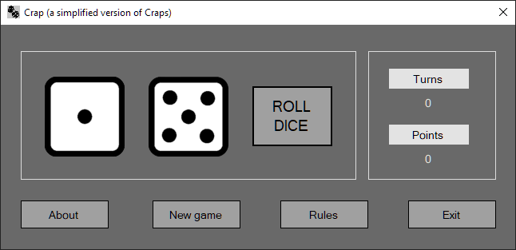

# Craps Dice

Current version is v0.9.1.0

This is a simplified version of a casino game called Craps.

---

Here is how to play:

The rules for the first turn:
* If you roll 7 or 11 you win
* If you roll 2, 3 or 12 you lose
    * If you roll 2 in the first round it is called snake eyes

The rules for all subsequent turns:
* If you roll the same sum as the previous round you win
* If you roll 7 you lose
